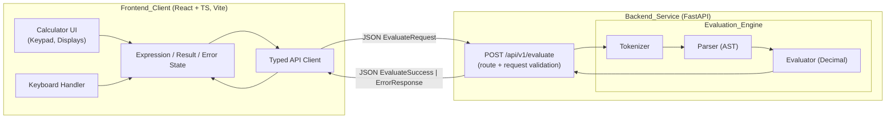
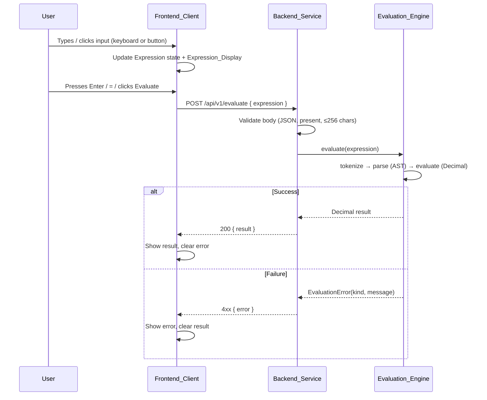
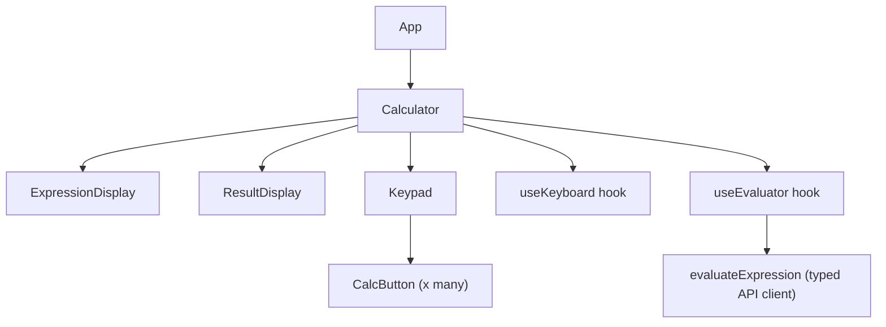

# Design Document

## Overview

This document describes the technical design for a modern, responsive web calculator that evaluates chained arithmetic expressions under strict PEMDAS precedence with exact decimal arithmetic. The system is split into two independently testable halves connected by a single REST contract:

- **Backend_Service** (Python 3.11+ / FastAPI): Owns all arithmetic. It exposes `POST /api/v1/evaluate`, which accepts an expression string, runs it through an **Evaluation_Engine** (tokenizer → recursive-descent parser producing an AST → evaluator over `decimal.Decimal`), and returns either a numeric result or a structured error.
- **Frontend_Client** (React + TypeScript, Vite): Owns all UI and input state. It renders a physical-calculator layout, captures mouse/touch/keyboard input, maintains the current expression string, calls the backend for evaluation, and renders results/errors. It performs **no** arithmetic locally.

The central design principle (Requirement 14) is a hard separation of concerns: the frontend is a stateful input/rendering surface, the backend is a stateless math oracle, and the only coupling between them is the typed JSON contract of the Evaluate_Endpoint.

### Key Design Decisions

| Decision | Rationale | Requirements |
| --- | --- | --- |
| Exact arithmetic via Python `decimal.Decimal` throughout the evaluator | Avoids binary floating-point error (`0.1 + 0.2` must equal `0.3`) | 3.1–3.4 |
| Hand-written recursive-descent parser producing an explicit AST | Gives full control over PEMDAS precedence, unary minus, right-associative exponentiation, and enables the round-trip property | 2.1–2.6, 6.1–6.4 |
| All calculation server-side; frontend never computes | Enforces separation of concerns and a single source of arithmetic truth | 14.1–14.4 |
| Discriminated union response (`result` XOR `error`) | Unambiguous success/failure distinction for the typed client | 5.5, 13.1–13.5 |
| Error taxonomy mapped 1:1 to 4xx responses | Descriptive, testable error handling | 4.1–4.6 |
| CSS Grid keypad + `clamp()`/media queries | Responsive, no overflow, ≥44px touch targets on mobile | 8.1–8.4, 9.1–9.4 |
| ARIA live regions + labels + role fallback | Screen reader conveys state changes | 11, 12 |

## Architecture



### Request Flow



The layers are strictly ordered: transport (FastAPI route) → validation → tokenizer → parser → evaluator. Each layer only depends on the layer directly below it, which keeps the pure computation (tokenizer/parser/evaluator) free of HTTP concerns and independently unit-testable (Requirement 14, 15).

## Components and Interfaces

### Backend Components

#### 1. API Layer (`app/api/routes.py`)
- Defines the FastAPI router and the `POST /api/v1/evaluate` handler (Requirement 5.1).
- Uses a Pydantic request model to enforce the body shape and the 1–256 character constraint (Requirements 5.2, 5.6, 1.5).
- Delegates evaluation to the Evaluation_Engine and maps outcomes to HTTP responses:
  - Success → `200` with `{ "result": "<string>" }`, `Content-Type: application/json` (Requirement 5.3, 5.5).
  - Domain evaluation errors → `422` (or `400` for malformed body) with `{ "error": "<message>" }` (Requirements 4.6, 5.4, 5.5).
- Never returns both `result` and `error` (Requirement 5.5).

#### 2. Evaluation_Engine (`app/engine/`)
The pure computation core, HTTP-agnostic. Public entry point:

```python
def evaluate_expression(expression: str) -> Decimal:
    """Tokenize, parse, and evaluate an arithmetic expression.
    Raises EvaluationError subclasses on any failure."""
```

Sub-components:

- **Tokenizer** (`tokenizer.py`): Converts the raw string into a token stream. Recognizes numbers (with a single decimal point), operators `+ - * / ^`, and parentheses `( )`. Rejects any other character with `InvalidCharacterError` (Requirement 4.4). Skips insignificant whitespace.
- **Parser** (`parser.py`): Recursive-descent parser that consumes tokens and produces an AST. Encodes PEMDAS precedence and associativity directly in its grammar (Requirements 2.1–2.6, 6.1). Raises `SyntaxError`-family errors for invalid operator sequences (Requirement 4.2), unclosed parentheses (Requirement 4.3), and empty input (Requirement 4.5). Provides an inverse `render(node) -> str` used by the round-trip property (Requirement 6.3).
- **Evaluator** (`evaluator.py`): Walks the AST and computes a `Decimal` using a configured `decimal.Context`. Raises `DivisionByZeroError` when a divisor evaluates to zero (Requirement 4.1). Applies rounding for non-terminating results (Requirement 3.4).
- **Errors** (`errors.py`): The `EvaluationError` hierarchy (see Error Handling).

#### 3. Application Assembly (`app/main.py`)
- Instantiates the FastAPI app, mounts the router, and configures CORS so the Vite dev server (and deployed frontend) can call the endpoint (supports Requirement 14.3).

### Frontend Components

Component tree:



- **`App`**: Root shell, layout container, mounts `Calculator`.
- **`Calculator`**: Owns all state (expression, result, error, status). Wires the keypad, displays, keyboard hook, and evaluation hook. Contains the reducer/state logic (Requirement 14.1).
- **`ExpressionDisplay`**: Renders the current expression string; empty in initial state (Requirements 7.1, 7.3). `aria-live="polite"` (Requirement 12.3).
- **`ResultDisplay`**: Renders the result or error message; empty in initial state (Requirements 7.2, 7.4, 7.5). Result region `aria-live="polite"`, error region `aria-live="assertive"` (Requirements 12.3, 12.4).
- **`Keypad`**: CSS Grid layout of `CalcButton`s in the physical calculator arrangement (Requirements 8.1–8.4).
- **`CalcButton`**: A native `<button>` with visible label and `aria-label` matching its function (Requirements 11.6, 12.1, 12.2).
- **`useKeyboard`**: Global `keydown` listener mapping keys to actions (Requirement 10.1–10.8).
- **`useEvaluator`**: Calls the typed API client, manages loading/error, and enforces that results only come from the backend (Requirements 14.3, 14.4).

### API Contract

**Endpoint:** `POST /api/v1/evaluate`

Request body:
```json
{ "expression": "12.5 + 3 * (4 - 1.5) / 2" }
```

Success response — `200 OK`, `Content-Type: application/json`:
```json
{ "result": "8.25" }
```

Error response — `4xx`, `Content-Type: application/json`:
```json
{ "error": "Division by zero is not allowed." }
```

The `result` field is a **string** carrying the exact decimal representation, avoiding any JSON-number/float coercion that would reintroduce precision loss (Requirements 3.1–3.3). Success and error payloads are mutually exclusive (Requirement 5.5).

Corresponding TypeScript interfaces (Requirement 13):
```typescript
export interface EvaluateRequest {
  expression: string;
}
export interface EvaluateSuccess {
  result: string;
}
export interface ErrorResponse {
  error: string;
}
export type EvaluateResponse = EvaluateSuccess | ErrorResponse;

// Narrowing guards (Requirement 13.5)
export function isSuccess(r: unknown): r is EvaluateSuccess { /* checks shape */ }
export function isError(r: unknown): r is ErrorResponse { /* checks shape */ }
```
The client constructs requests conforming to `EvaluateRequest` with no use of `any` (Requirement 13.4). Any response that satisfies neither guard is treated as an error (Requirement 13.5).

## Data Models

### Grammar

The parser implements the following grammar (EBNF-style), with productions ordered from lowest to highest precedence to encode PEMDAS. This is the source of truth for Requirements 2.1–2.6 and 6.1.

```
expression   = term , { ("+" | "-") , term } ;          (* add/sub, left-assoc *)
term         = factor , { ("*" | "/") , factor } ;       (* mul/div, left-assoc *)
factor       = unary , [ "^" , factor ] ;                (* exponent, right-assoc *)
unary        = ("-" , unary) | primary ;                 (* unary minus *)
primary      = number | "(" , expression , ")" ;
number       = digit , { digit } , [ "." , digit , { digit } ]
             | "." , digit , { digit } ;
```

Precedence, low → high: `+ -` < `* /` < `^` < unary `-` < parentheses. Note that `factor = unary , [ "^" , factor ]` makes `^` right-associative (Requirement 2.4), and because the exponent's base is a `unary` while the whole `^` chain sits above unary minus at the top level, `-3^2` parses as `-(3^2)` = `-9` (Requirement 2.6).

### AST Node Types

```python
@dataclass(frozen=True)
class NumberNode:
    value: Decimal            # exact operand value

@dataclass(frozen=True)
class UnaryOpNode:
    op: str                   # "-"
    operand: "Node"

@dataclass(frozen=True)
class BinaryOpNode:
    op: str                   # "+", "-", "*", "/", "^"
    left: "Node"
    right: "Node"

Node = NumberNode | UnaryOpNode | BinaryOpNode
```

### Token Model

```python
class TokenType(Enum):
    NUMBER = auto()
    PLUS = auto(); MINUS = auto(); STAR = auto(); SLASH = auto(); CARET = auto()
    LPAREN = auto(); RPAREN = auto()
    EOF = auto()

@dataclass(frozen=True)
class Token:
    type: TokenType
    lexeme: str
    position: int             # index in source, used for error messages
```

### Request/Response Models (Pydantic)

```python
class EvaluateRequest(BaseModel):
    expression: str = Field(min_length=1, max_length=256)   # Req 5.2, 5.6, 1.5

class EvaluateSuccess(BaseModel):
    result: str                                             # Req 5.3, 5.5

class ErrorResponse(BaseModel):
    error: str                                              # Req 5.4, 5.5
```

### Decimal Precision Model

- A module-level `decimal.Context` is configured with sufficient working precision (e.g., `prec = 50`) so intermediate operations do not lose significance.
- All operands are constructed as `Decimal(str_literal)` directly from their source lexemes (never via `float`), guaranteeing exact operand values (Requirement 3.3).
- Terminating results are returned as-is with trailing-zero normalization so `0.1 + 0.2` yields exactly `0.3` (Requirements 3.1, 3.2).
- Non-terminating quotients (e.g., `1 / 3`) are rounded to at least 10 significant digits using `ROUND_HALF_EVEN` (Requirement 3.4).

## Correctness Properties

*A property is a characteristic or behavior that should hold true across all valid executions of a system — essentially, a formal statement about what the system should do. Properties serve as the bridge between human-readable specifications and machine-verifiable correctness guarantees.*

The arithmetic core (tokenizer → parser → evaluator) is a pure function over strings, which makes it an ideal target for property-based testing. The following properties are derived from the prework analysis. Precedence and associativity criteria (Requirements 2.1–2.6, 1.1–1.4) are consolidated into a single model-based property (P1) that compares the engine against a reference `Decimal` evaluation of the parsed AST, because a shared reference oracle validates all of these rules simultaneously. UI-layout, contrast, and pure type-definition criteria are handled by non-PBT strategies (see Testing Strategy) rather than as properties.

### Property 1: Engine matches PEMDAS/Decimal reference evaluation

*For any* valid expression generated from the arithmetic grammar, evaluating it with the Evaluation_Engine SHALL produce a result equal (to at least 10 significant decimal digits) to an independent reference evaluation of the same parsed AST computed with exact `Decimal` arithmetic under PEMDAS precedence and the specified associativity (left-to-right for `+ - * /`, right-to-left for `^`, exponentiation before unary minus).

**Validates: Requirements 1.1, 1.2, 1.3, 1.4, 2.1, 2.2, 2.3, 2.4, 2.5, 2.6, 3.2, 3.3, 6.1**

### Property 2: Non-terminating division is rounded to ≥10 significant digits (round-half-even)

*For any* expression whose exact mathematical result is a non-terminating decimal, the Evaluation_Engine SHALL return a value with at least 10 significant decimal digits that equals the `Decimal` division of the same operands performed under the configured context using `ROUND_HALF_EVEN`.

**Validates: Requirements 3.4**

### Property 3: Parser round-trip preserves value

*For any* valid AST generated by the grammar, rendering it to an expression string and parsing that string again SHALL yield a structure that, when evaluated, produces a result equal to the original AST's evaluation to at least 10 significant decimal digits, thereby conforming to the same PEMDAS precedence.

**Validates: Requirements 6.3, 6.4**

### Property 4: Division by zero always signals an error

*For any* expression in which a divisor subexpression evaluates to zero, the Evaluation_Engine SHALL raise a division-by-zero error (surfaced by the Backend_Service as a 4xx Error_Response with a descriptive message) and SHALL NOT return a calculated result.

**Validates: Requirements 4.1**

### Property 5: Invalid characters always signal an error

*For any* otherwise-valid expression into which a character that is not an operator, digit, decimal point, or parenthesis is inserted, the Backend_Service SHALL return an Error_Response with a descriptive message identifying the invalid character and SHALL NOT return a result.

**Validates: Requirements 4.4**

### Property 6: Response shape is an unambiguous success-XOR-error discriminated union

*For any* request submitted to the Evaluate_Endpoint, the response SHALL contain exactly one of the `result` field or the `error` field (never both, never neither); a successful evaluation SHALL yield HTTP 200 with a `result` and `Content-Type: application/json`, and any failed evaluation SHALL yield an HTTP 4xx status with an `error`.

**Validates: Requirements 4.6, 5.3, 5.4, 5.5**

### Property 7: Expressions exceeding the length limit are rejected

*For any* expression string longer than 256 characters, the Backend_Service SHALL reject it with a 4xx Error_Response whose message identifies that the maximum length was exceeded, and SHALL NOT return a calculated result.

**Validates: Requirements 1.5, 5.6**

### Property 8: Mapped character keys append their character

*For any* key mapped to a character (digits `0`–`9`, operators `+ - * /`, decimal point `.`, and parentheses `( )`), pressing that key SHALL append exactly that character to the current Expression, increasing its length by one.

**Validates: Requirements 10.1, 10.2, 10.3**

### Property 9: Backspace removes exactly the last character

*For any* non-empty Expression, pressing `Backspace` SHALL produce an Expression equal to the original with its final character removed (length decreased by exactly one).

**Validates: Requirements 10.5**

### Property 10: Escape resets to the empty state

*For any* Frontend_Client state, pressing `Escape` SHALL result in an empty Expression and a cleared Result_Display.

**Validates: Requirements 10.7**

### Property 11: Unmapped keys are no-ops

*For any* key that is not mapped to a calculator function, pressing it SHALL leave both the Expression and the Result_Display unchanged.

**Validates: Requirements 10.8**

### Property 12: Every control exposes a matching accessible label

*For any* interactive calculator control rendered by the Frontend_Client, the control SHALL expose an `aria-label` whose value corresponds to the control's visible function.

**Validates: Requirements 12.1**

### Property 13: Non-conforming responses are treated as errors

*For any* JSON payload returned from the Evaluate_Endpoint that conforms to neither the `EvaluateSuccess` interface nor the `ErrorResponse` interface, the Frontend_Client SHALL treat the response as an error and display an error message to the User.

**Validates: Requirements 13.5**

## Error Handling

All domain errors derive from a common `EvaluationError` base carrying a `kind` and a human-readable `message`. The API layer maps each to a 4xx status and an `ErrorResponse` body (Requirement 4.6, 5.4). No error path returns a `result` field (Requirement 5.5).

| Error class | Trigger | Layer | HTTP status | Message (descriptive) | Requirement |
| --- | --- | --- | --- | --- | --- |
| `EmptyExpressionError` | Empty or whitespace-only expression | Parser | 422 | "No expression was provided." | 4.5 |
| `InvalidCharacterError` | Character outside `[0-9. +-*/^()]` | Tokenizer | 422 | "Invalid character '{c}' at position {i}." | 4.4 |
| `InvalidSyntaxError` | Invalid operator sequence / malformed structure | Parser | 422 | "Invalid operator sequence near position {i}." | 4.2 |
| `UnbalancedParenthesesError` | Unclosed / unmatched parenthesis | Parser | 422 | "Unclosed parenthesis at position {i}." | 4.3 |
| `DivisionByZeroError` | Divisor subexpression evaluates to zero | Evaluator | 422 | "Division by zero is not allowed." | 4.1 |
| Request validation (Pydantic) | Malformed JSON, missing field, >256 chars | API/transport | 400 / 422 | "Request body is malformed or the expression exceeds the maximum length of 256 characters." | 1.5, 5.6 |

Handling flow:
- The tokenizer and parser fail fast on the first violation, preserving the source position for descriptive messages.
- A single FastAPI exception handler catches `EvaluationError` subclasses and serializes them to `ErrorResponse`, choosing the mapped status code.
- Pydantic validation failures (invalid/missing/oversize body) are caught by an exception handler that returns the same `ErrorResponse` shape rather than FastAPI's default error body, so the frontend contract stays uniform (Requirement 5.6, 13.5).

Frontend error handling:
- On a 4xx response, the client parses `error` and renders it in the Result_Display's error region, clearing any prior result (Requirements 7.5, 7.6).
- On a network/transport failure (backend unreachable), the client shows a fixed "The evaluation service is unavailable." message and never displays a locally computed result (Requirement 14.4).
- On a response matching neither typed shape, the client falls back to a generic error (Requirement 13.5).

## Testing Strategy

### Dual Approach

The backend arithmetic core is tested with **both** property-based tests (universal correctness across generated inputs) and example-based unit tests (specific documented behaviors, edge cases, and error conditions). The frontend is tested primarily with example-based component/reducer tests plus a small set of property-style tests for its pure reducer logic; layout and contrast are validated with tooling and manual review because they are not expressible as universal computable properties.

### Property-Based Testing (Backend)

- **Library:** [Hypothesis](https://hypothesis.readthedocs.io/) for Python. We do not implement property testing from scratch.
- **Generators:** A recursive strategy builds random valid ASTs (numbers as `Decimal` from string literals, unary minus, binary `+ - * / ^`, nested parentheses) with bounded depth; a `render(ast)` function serializes them to strings for the round-trip and model-based properties. Separate strategies generate invalid inputs (disallowed characters, zero divisors, over-length strings).
- **Configuration:** Each property test runs a **minimum of 100 iterations** (`@settings(max_examples=100)` or higher).
- **Reference oracle:** A small independent evaluator over the AST using `Decimal` provides the expected value for Property 1 (model-based testing).
- **Tagging:** Each property test is tagged with a comment in the form
  `# Feature: web-calculator, Property {number}: {property_text}`.

Property → test mapping:

| Property | Test focus | Requirements |
| --- | --- | --- |
| P1 | Engine result == reference Decimal AST evaluation | 1.1–1.4, 2.1–2.6, 3.2, 3.3, 6.1 |
| P2 | Non-terminating division rounding / ≥10 sig digits | 3.4 |
| P3 | `evaluate(parse(render(ast))) == evaluate(ast)` | 6.3, 6.4 |
| P4 | Zero-divisor expressions raise div-by-zero → 4xx | 4.1 |
| P5 | Injected invalid character → error | 4.4 |
| P6 | Response has exactly one of result/error, correct status | 4.6, 5.3, 5.4, 5.5 |
| P7 | Strings > 256 chars rejected | 1.5, 5.6 |

### Example-Based Unit Tests (Backend, pytest)

Focused examples complement the properties (Requirement 15):
- **PEMDAS across ≥3 precedence levels** (Requirement 15.1): e.g. `2 + 3 * 4 ^ 2 == 50`, `12.5 + 3 * (4 - 1.5) / 2 == 16.25`, asserting exact expected values.
- **Associativity/unary examples**: `2^2^3 == 256` (2.4), `8/4/2 == 1` and `8-4-2 == 2` (2.5), `-3^2 == -9` (2.6).
- **Decimal exactness**: `0.1 + 0.2 == Decimal("0.3")` (3.1).
- **Each Requirement 4 error case** (Requirement 15.2): division by zero, invalid operator sequence (`3 + * 4`), unclosed parentheses (`(1 + 2`), invalid characters (`2 & 3`), empty/whitespace (`""`, `"   "`) — each asserting an Error_Response with a 4xx status.
- **Boundary lengths**: expressions of length 1 and 256 accepted; 257 rejected (5.2, 5.6).
- **Round-trip test presence** (Requirement 15.3): the Hypothesis round-trip property (P3) satisfies the mandated round-trip parsing test across many samples.
- The full suite must pass (Requirement 15.4).

### Frontend Testing

- **Framework:** [Vitest](https://vitest.dev/) + [React Testing Library](https://testing-library.com/docs/react-testing-library/intro/); network calls mocked (e.g., MSW).
- **Reducer property-style tests** (pure state logic): P8 (character-append over the set of mapped keys), P9 (backspace removes last char), P10 (escape resets), P11 (unmapped keys no-op). These use fast-check-style generation or table-driven cases over the key set. Requirements 10.1–10.8.
- **Component/example tests:**
  - Displays empty initially; expression display updates on input; result/error rendered; result and error mutually exclusive (Requirements 7.1–7.6).
  - All required controls present; keypad arrangement 7-8-9 / 4-5-6 / 1-2-3 with 0 below; operators grouped (Requirements 8.1–8.3).
  - `aria-label` present on every control matching function (P12 / Requirement 12.1); `aria-live` regions configured `polite`/`assertive` (Requirements 12.3–12.5); active-state indication on press (11.5); visible labels (11.6).
  - API client: builds a typed `EvaluateRequest`; success renders result; 4xx renders error; malformed response treated as error (P13 / Requirement 13.5); network failure shows "service unavailable" and no local result (Requirement 14.4); results only appear via an API call (Requirement 14.3).
- **Type safety** (Requirements 13.1–13.4): enforced by `tsc` strict mode and an ESLint `no-explicit-any` rule over client code, verified in CI.

### Layout, Responsiveness, and Contrast (non-PBT)

These criteria are visual/measured and are not expressible as universal properties:
- **Responsive layout** (Requirements 8.4, 9.1–9.4): checked at representative viewport widths (mobile 320–767, tablet 768–1023, desktop 1024–2560) for no horizontal overflow, no clipping, and ≥44×44px touch targets on mobile — via component tests reading computed styles and/or visual regression.
- **Contrast** (Requirements 11.1–11.4): validated with an automated accessibility audit (e.g., axe-core) plus manual review. Full WCAG conformance requires manual testing with assistive technologies and expert review, which the automated checks supplement but do not replace.

### Module / File Structure

```
backend/
  app/
    main.py                 # FastAPI app assembly, CORS, exception handlers
    api/
      routes.py             # POST /api/v1/evaluate
      schemas.py            # Pydantic EvaluateRequest/Success/ErrorResponse
    engine/
      __init__.py           # evaluate_expression(expr) entry point
      tokenizer.py
      parser.py             # parse() + render()
      evaluator.py          # Decimal evaluation, context/rounding
      errors.py             # EvaluationError hierarchy
  tests/
    test_pemdas.py          # example-based PEMDAS + associativity
    test_errors.py          # Requirement 4 error cases
    properties/
      strategies.py         # Hypothesis AST generators + render
      test_engine_property.py    # P1, P2
      test_roundtrip.py          # P3
      test_error_properties.py   # P4, P5
    test_api.py             # P6, P7, response shape, status codes

frontend/
  src/
    api/
      types.ts              # EvaluateRequest / EvaluateSuccess / ErrorResponse + guards
      client.ts             # evaluateExpression()
    state/
      calculatorReducer.ts  # pure expression/result/error state transitions
    hooks/
      useKeyboard.ts
      useEvaluator.ts
    components/
      Calculator.tsx
      ExpressionDisplay.tsx
      ResultDisplay.tsx
      Keypad.tsx
      CalcButton.tsx
    App.tsx
    styles/                 # responsive grid, contrast-compliant theme
  tests/
    reducer.test.ts         # P8–P11
    components.test.tsx      # displays, layout presence, a11y (P12)
    client.test.ts          # P13, success/error/network handling
```
