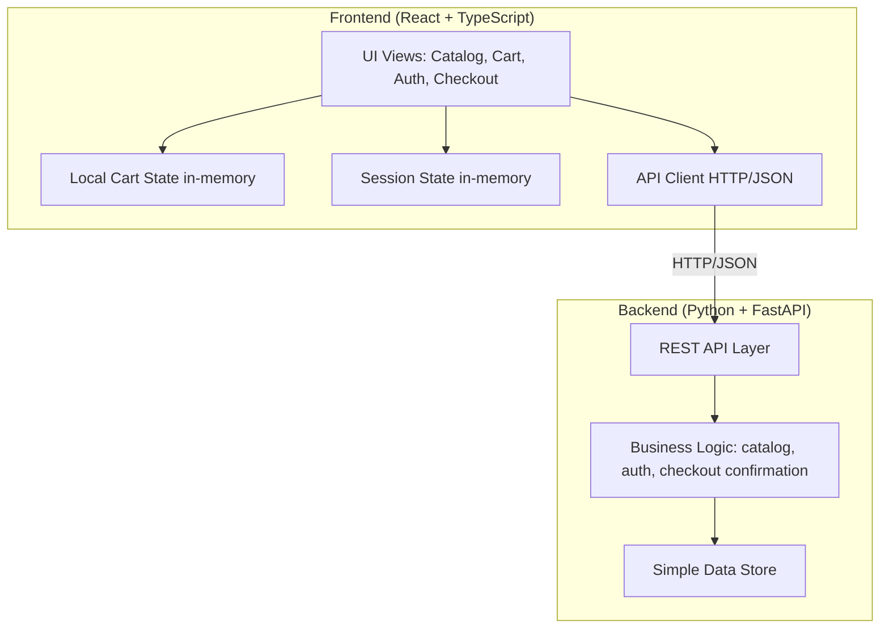

# Design Document

## Overview

This design describes a demonstration e-commerce web application for Stage 1. It covers one continuous purchasing journey: browse the catalog, add and manage a locally held cart, register or sign in with basic authentication, and complete a simulated checkout. The system behaves as one integrated whole, with product identity, quantities, and totals staying consistent from catalog to cart to checkout.

The design is intentionally minimal. Every technical decision below is made only to make the approved requirements implementable, and nothing in the Scope Restrictions section of the requirements is designed. The application is split into a React + TypeScript frontend (presentation) and a Python + FastAPI backend (catalog data and account data), which run and are reviewed separately and communicate through a clear HTTP/JSON interface.

### Scope Boundaries Honored

The following are explicitly **not** designed, matching the requirements' Scope Restrictions verbatim: text/quick search, advanced or multi-criteria filters, recommendations, complex catalog classification, mandatory `localStorage` cart persistence, address management/selection, tax breakdown, real payments/card storage/payment-gateway integration, real-time inventory, coupons, dynamic shipping, reviews/ratings/moderation, multiple currencies, seller/administrator functionality, containers, CI/CD, mandatory end-to-end tests, API caching, advanced access controls, multi-factor authentication, external identity providers, password recovery, email verification, advanced profile management, production infrastructure, distributed services, asynchronous processing, and real external integrations.

### Requirement Coverage Summary

| Requirement | Addressed by |
| --- | --- |
| R1 Browse catalog | Catalog component, Catalog API (`GET /products`, `GET /products/{id}`), Product data model |
| R2 Add to cart | Cart component (client-side), add-to-cart action with confirmation feedback |
| R3 View/manage cart | Cart component, cart totals logic, empty-state and removal confirmation |
| R4 Cart persistence scope | Client-side in-memory cart state only; no durable persistence |
| R5 Registration | Authentication component, `POST /auth/register`, validation rules |
| R6 Sign in/out | Authentication component, `POST /auth/login`, `POST /auth/logout`, session indicator |
| R7 Secure auth data | Password input masking, no plain-text display/storage, hashed storage, safe error messages |
| R8 Identification during journey | Checkout gate, auth modal/view, cart preservation across auth |
| R9 Proceed to checkout | Checkout component, summary view, empty-cart guard |
| R10 Complete simulated purchase | `POST /checkout/confirm`, fictitious-payment notice, confirmation + summary, reset-to-new-purchase |
| R11 Continuous/consistent journey | Shared product identity, single source of totals, cross-view consistency |
| R12 Feedback and states | Loading/empty/error/invalid-data UI states across components |
| R13 Usable/accessible interface | Responsive layout, labeled controls, label-field association, keyboard navigation |
| R14 Technology/architecture/language | React+TS frontend, Python+FastAPI backend, separation, English artifacts |

## Architecture

### High-Level Structure

The solution is a two-part project: a frontend application and a backend service, each runnable and reviewable on its own. They communicate exclusively over an HTTP/JSON API. The frontend owns all presentation and the locally managed cart state; the backend owns catalog data, account data, authentication, and the non-persistent checkout confirmation.



This structure satisfies Requirement 14: the UI is separated from server-side logic (R14.3), the two sides communicate through a clear interface so presentation, business logic, and data access are not mixed (R14.4), and the project is laid out so each side runs and is reviewed separately (R14.5).

### Layering Rationale

- **Presentation / business-logic / data-access separation (R14.4):** The frontend holds presentation and journey state. The backend separates its own concerns into an API layer (request/response), a service layer (business rules such as validation, authentication, checkout confirmation summary building), and a data-access layer (reading catalog data and reading/writing account data). The frontend never reaches the data store directly; it always goes through the API.
- **Cart lives on the frontend (R4):** The cart is managed locally within the application during the Active_Journey and is held in frontend in-memory state. It is not persisted durably across browser closures or separate sessions, and durable persistence is not required. Because cart items reference the same product identities served by the catalog API, consistency across views is preserved without a server-side cart.
- **Simulated-only backend (R10):** Checkout confirmation is a non-persistent operation that builds a fictitious purchase summary from the submitted cart and catalog data; it stores no order record, performs no real charge, and contacts no payment gateway.

### Data Store Choice

The catalog and account data use a simple mechanism appropriate for a demonstration (R14.6). Concretely, the backend keeps catalog products as fixed in-memory demonstration data and keeps account data in in-process storage for the running service. Checkout confirmation is non-persistent: no order record is stored. This is the lightest mechanism that satisfies the requirements without introducing production infrastructure, distributed services, or external integrations, all of which are out of scope. No specific heavy data store, engine, or version is prescribed.

### Project Structure

A top-level layout keeps the two parts independent and separately runnable (R14.5):

```
/frontend   React + TypeScript application (presentation, cart state, API client)
/backend    Python + FastAPI service (API, services, data store)
```

Each part has its own entry point, dependencies, and run command, and is reviewed on its own.

## Components and Interfaces

### Frontend Components

The frontend is organized around the four functional components described in the requirements. All user-facing text and identifiers are in English (R14.7).

- **Catalog** — Presents the product list as the initial view (R1.2). For each product it shows name, one representative image, a short description, the price, and a general availability indication (R1.3). It is reachable without authentication (R1.1). If an expanded product view is included, it shows the same commercial information as the list entry (R1.4). It uses the same demonstration product data that the rest of the flow uses (R1.5), because that data comes from the shared catalog API. Each product offers an add action (R2.1).

- **Cart** — Client-side component that holds selected products and quantities in in-memory state (R4.1). It displays each product, quantity, unit price, and the accumulated total (R3.1); updates quantity and total immediately on adjustment while keeping unit price consistent (R3.2); removes a product and shows a visible removal confirmation (R3.3); shows an empty-state indication when it contains no products (R3.4); and retains contents for viewing throughout the Active_Journey (R3.5, R4.1). Adding a product updates its displayed contents without further user action (R2.3) and triggers a visible add confirmation (R2.2).

- **Authentication** — Provides registration (R5), sign-in and sign-out (R6), and the active/inactive session indicator (R6.4, R6.5). It works with the minimum credential contract — an `identifier` and a `password` — accepting the `password` only as input. It renders password fields in an obscured form (R7.1) and never displays passwords as readable text (R7.2). It shows field labels describing expected input (R5.2, R6.2), validates required/format rules (R5.3, R5.4, R6.3), excludes previously entered credential values from error messages (R5.5), and presents authentication errors without unnecessary internal detail (R7.4). It displays visible confirmations for sign-in and sign-out (R6.7, R6.8).

- **Checkout** — Presents the pre-confirmation summary of products, quantities, and total (R9.1); requests only the minimum demonstration information, if any (R9.2); provides no address book or saved-address selection (R9.3, R9.4); prevents proceeding when the cart is empty (R9.5); displays the fictitious-payment notice (R10.1); shows an unambiguous confirmation with a purchased-items summary on success (R10.2, R10.4); and returns the application to a comprehensible state from which a new purchase can start (R10.3). Before allowing completion it enforces identification: if the person is not identified it offers sign-in and register options and blocks completion until they are identified (R8.1, R8.2).

### Shared Journey State (Frontend)

To keep the journey continuous and consistent (R11), the frontend maintains two in-memory stores shared across components:

- **Cart state** — The authoritative client-side list of cart items `{ productId, quantity }`, with product details resolved from the catalog data loaded from the backend. All views (Cart, Checkout) derive quantities and totals from this single source, so product identity, name, price, per-product quantity, and total match across views (R11.2–R11.6). This state is preserved across sign-in and registration so no cart items are lost during authentication (R8.3, R8.4).
- **Session state** — Whether a Session is active and the identified customer's display identity, used to drive the visible session indicator (R6.4, R6.5) and the checkout identification gate (R8).

Because the cart stores product identifiers and resolves details from the shared catalog data, the Cart and Checkout always show the same identity, name, and price as the Catalog (R11.1).

### Backend Service Layers

- **API layer (FastAPI):** Defines the HTTP endpoints below, validates request shape, and returns JSON responses and appropriate status codes. It drives the loading/error states on the frontend (R12.2, R12.4).
- **Service layer:** Catalog retrieval, registration/sign-in validation and account creation, session establishment, and non-persistent checkout confirmation summary building from the submitted cart and catalog data.
- **Data-access layer:** Reads demonstration catalog data; reads and writes account data in the simple demonstration store. It stores no order records.

### API Interface (Frontend ↔ Backend)

The interface is HTTP/JSON. All field names and messages are in English (R14.7). Request/response bodies use the data models in the next section. The minimum endpoints needed by the requirements are:

| Method | Path | Purpose | Requirements |
| --- | --- | --- | --- |
| `GET` | `/products` | List catalog products (no authentication required). | R1.1, R1.3, R1.5, R11.1 |
| `GET` | `/products/{id}` | Retrieve a single product for an expanded view, if used. | R1.4 |
| `POST` | `/auth/register` | Create a Customer account from valid registration input. | R5.1, R5.3, R5.4, R5.6 |
| `POST` | `/auth/login` | Validate sign-in input and establish a Session. | R6.1, R6.3, R6.9 |
| `POST` | `/auth/logout` | End the active Session. | R6.6 |
| `POST` | `/checkout/confirm` | Build and return a non-persistent confirmation summary from the submitted cart contents; stores no order. | R10.2, R10.3 |

Interface behavior notes:

- `GET /products` returns the demonstration product data shared across the whole flow (R1.5, R11.1).
- `POST /auth/register` accepts the credential contract (`identifier` and `password`) and returns success only when all required items are present and conform to their expected format (R5.6); otherwise it returns a structured error that identifies each empty required item and each non-conforming item (R5.3, R5.4) and never echoes submitted credential values (R5.5). The `password` is accepted only as input and is stored only as `passwordHash`.
- `POST /auth/login` accepts the `identifier` and `password`, returns a session representation on complete, valid input (R6.9), and returns an authentication error that indicates failure without unnecessary internal detail on invalid/incomplete input (R6.3, R7.4).
- `POST /checkout/confirm` accepts the submitted cart contents (product identifiers and quantities) and uses catalog data to construct and validate the confirmation summary so product information stays consistent, returning only what is necessary for the confirmation: the purchased-items summary and total (R10.2). The response contains no order ID and no creation timestamp, stores no order record, performs no real charge, and contacts no payment gateway (R10.1). The empty-cart guard (R9.5) is enforced on the frontend before this call and may be re-checked server-side by rejecting an empty submission.
- Passwords are transmitted only as part of auth requests and are never returned in any response (R7.2, R7.3).

## Data Models

All models use English identifiers (R14.7). Monetary values use the demonstration currency implied by the catalog data; no multi-currency support is designed.

### Product (backend-owned, served to frontend)

Represents an item offered in the catalog (R1.3).

```
Product
  id: string            # stable product identity used across catalog, cart, checkout (R11)
  name: string          # product name
  imageUrl: string      # one representative image
  description: string   # short description text
  price: number         # unit price in the demonstration currency
  available: boolean     # general availability indication
```

### CartItem (frontend-owned, in-memory)

Represents a product selected into the local cart with its quantity (R2, R3, R4).

```
CartItem
  productId: string     # references Product.id (shared identity, R11)
  quantity: integer      # count of this product in the cart
```

The cart as a whole is the list of `CartItem` plus derived values computed on the frontend:

```
CartView (derived, not stored)
  items: list of { product: Product, quantity: integer, unitPrice: number, lineTotal: number }
  total: number          # sum of lineTotal across items (R3.1, R3.2, R11.5)
```

`lineTotal = product.price * quantity`, and `total = sum(lineTotal)`. These derivations are the single source used by both the Cart and Checkout views, guaranteeing matching quantities and totals (R11.4, R11.5).

### Customer (backend-owned)

Represents an account used to identify a Customer (R5, R6). It collects only the minimum data necessary to identify a Customer, which is the generic credential contract: an `identifier` and a `password`. These are treated strictly as technical credential values; no profile data (email, name, address) or business-specific semantics are added, and no field lengths, password-complexity rules, or other format thresholds are prescribed.

```
Customer
  id: string                 # account identity
  identifier: string          # the credential identifier used to identify a Customer (R5.1)
  passwordHash: string        # hashed credential; never plain text (R7.3)
```

The `password` is accepted only as request input on register/login; it is stored only in hashed form (`passwordHash`) and is never stored or returned as readable plain text (R7.2, R7.3). The credential contract is kept to the `identifier` + `password` minimum, because the inputs do not enumerate additional fields or formats and inventing field requirements is out of scope.

### Session (backend-established, reflected on frontend)

Represents that a Customer is signed in (R6.9).

```
Session
  active: boolean            # drives the visible session indicator (R6.4, R6.5)
  customerId: string         # the identified Customer
```

The frontend keeps a corresponding in-memory session representation to render the active/inactive indicator and gate checkout identification. No password or credential value is held in session state (R7.3).

### CheckoutRequest (non-persistent, request input)

Represents the cart contents submitted for a Simulated_Purchase (R10). It carries only product identifiers and quantities; the backend resolves product details from catalog data.

```
CheckoutRequest
  items: list of { productId: string, quantity: integer }  # submitted cart contents
```

### CheckoutConfirmation (non-persistent, response output)

Represents the confirmation summary returned for a completed Simulated_Purchase (R10). It is built from the submitted cart and catalog data and is not stored. It carries no order identity and no creation timestamp.

```
CheckoutConfirmation
  items: list of { productId, name, unitPrice, quantity, lineTotal }  # purchased-items summary
  total: number                               # purchased total (consistent with cart, R11.5)
  simulated: true                             # always a fictitious purchase (R10.1)
```

No order ID, creation timestamp, address, saved-address, tax-breakdown, or payment fields are modeled, matching R9.3, R9.4, the non-persistent checkout, and the Scope Restrictions.

## Correctness Properties

*A property is a characteristic or behavior that should hold true across all valid executions of a system — essentially, a formal statement about what the system should do. Properties serve as the bridge between human-readable specifications and machine-verifiable correctness guarantees.*

The following properties were derived from the acceptance criteria and consolidated to remove redundancy (for example, R11.6 is subsumed by the add-to-cart property, and R9.1/R11.3/R11.4/R11.5 are consolidated into one cart↔checkout consistency property). Each property is universally quantified and references the requirements it validates. Properties cover the pure, input-dependent logic of the application (cart math, consistency across views, validation, and credential safety); UI feedback events, static notices, responsive layout, and structural/scope constraints are covered by example, smoke, and integration tests in the Testing Strategy instead.

### Property 1: Adding a product makes it present in the cart

*For any* cart state and *any* catalog product, performing the add action for that product results in a cart whose contents include that product.

**Validates: Requirements 2.1, 11.6**

### Property 2: Cart total equals the sum of line totals

*For any* cart state, the displayed accumulated total equals the sum over all items of `unitPrice * quantity`, and each item's displayed unit price is unchanged by changes to its quantity.

**Validates: Requirements 3.1, 3.2**

### Property 3: Removing a product makes it absent from the cart

*For any* cart that contains a given product, removing that product results in a cart whose contents no longer include it.

**Validates: Requirements 3.3**

### Property 4: Cart contents are preserved across journey navigation

*For any* cart state and *any* sequence of view navigations within the Active_Journey that are not add, remove, or quantity-change actions, the cart contents remain unchanged.

**Validates: Requirements 3.5**

### Property 5: Registration validation rejects and identifies all offending fields

*For any* registration submission in which some required items are empty and/or some items do not conform to their expected format, the submission is rejected and the reported set of offending items equals exactly the set of items that are empty or non-conforming.

**Validates: Requirements 5.3, 5.4**

### Property 6: Registration error messages exclude submitted credential values

*For any* rejected registration submission, the displayed error message contains none of the credential values that were submitted.

**Validates: Requirements 5.5**

### Property 7: Valid, conforming registration creates an account

*For any* registration submission in which all required items are present and conform to their expected format, an account is created for that person.

**Validates: Requirements 5.6**

### Property 8: Sign-in validation rejects incomplete or invalid input

*For any* sign-in submission that is incomplete or invalid, the submission is rejected and the reported problem indicates the incomplete or invalid input.

**Validates: Requirements 6.3**

### Property 9: Sign-out ends the active session

*For any* active session, performing sign-out results in a state in which no session is active.

**Validates: Requirements 6.6**

### Property 10: Register-then-sign-in establishes a session (round trip)

*For any* valid customer credentials, registering with those credentials and then signing in with the same credentials establishes an active session for that customer.

**Validates: Requirements 6.9**

### Property 11: Passwords never appear as readable plain text in outputs

*For any* password entered through the flows, no rendered interface view and no API response contains that password as readable plain text.

**Validates: Requirements 7.2**

### Property 12: Passwords are not stored as readable plain text

*For any* password used to register an account, the stored credential representation is not the readable plain-text password.

**Validates: Requirements 7.3**

### Property 13: Completion is blocked while the person is not identified

*For any* journey state with a non-empty cart in which the person is not identified, the application prevents the journey from completing.

**Validates: Requirements 8.2**

### Property 14: Authentication preserves the active cart

*For any* cart state, performing either sign-in or registration during the Active_Journey results in a cart whose items equal the items that existed before the authentication action.

**Validates: Requirements 8.3, 8.4**

### Property 15: Checkout is reachable only when the cart is non-empty

*For any* cart state, proceeding to checkout as a valid purchase is permitted if and only if the cart is non-empty.

**Validates: Requirements 9.5**

### Property 16: Confirmation summary and total are derived from the submitted cart and catalog data

*For any* non-empty cart, confirming the simulated purchase yields a non-persistent confirmation whose purchased-items summary (product identity, name, unit price, quantity, line total) and total are derived from the submitted cart contents and catalog data, with the total equal to the sum of the line totals.

**Validates: Requirements 10.2, 10.3**

### Property 17: Completion resets to a state that allows a new purchase

*For any* successfully completed simulated purchase, the resulting application state permits the person to start a new purchase.

**Validates: Requirements 10.3**

### Property 18: Catalog and cart show consistent product identity

*For any* product added from the catalog, the identity, name, and price resolved for that product in the cart equal the identity, name, and price shown for it in the catalog, using the same demonstration product data.

**Validates: Requirements 1.5, 11.2**

### Property 19: Cart and checkout are consistent

*For any* non-empty cart, the checkout summary lists the same product identities, names, prices, per-product quantities, and total as the cart.

**Validates: Requirements 9.1, 11.3, 11.4, 11.5**

## Error Handling

Error, loading, and empty states are handled consistently across the frontend so the person always understands what is happening and what to do next (R12).

- **Invalid data (R12.1, R5.3, R5.4, R6.3):** Form submissions are validated before and after the API call. When required items are empty or items do not conform to their expected format, the submission is rejected and a visible message identifies the specific offending items. Error messages never include submitted credential values (R5.5) and never expose unnecessary internal system detail (R7.4).
- **Loading (R12.2):** While an API request is in flight (catalog load, registration, sign-in, checkout confirmation), the relevant view shows a visible loading indicator until the request completes or fails.
- **Empty states (R12.3, R3.4):** When there are no items to display — notably an empty cart — the view shows an empty-state indication describing the situation and the next step the person can take (for example, returning to the catalog to add products).
- **Request failure (R12.4):** When a request fails, the view shows a visible error indication explaining what happened and what the person can do next (for example, retry). The checkout empty-cart guard (R9.5) prevents proceeding when there is nothing to purchase.
- **Authentication errors (R7.4):** Authentication failures surface a message that indicates the failure to the user without revealing internal details, hashes, or submitted credential values.

Backend endpoints return structured JSON errors with appropriate HTTP status codes so the frontend can map each outcome to the correct user-facing state. No stack traces or internal diagnostics are included in responses sent to the client.

## Testing Strategy

The strategy pairs property-based tests (universal, input-varying logic) with unit, example, and integration tests (specific scenarios, UI feedback, and structural constraints). This combination gives comprehensive coverage without over-testing. Mandatory end-to-end tests are out of scope, so cross-component checks use lightweight example/integration tests rather than a full E2E suite.

### Property-Based Tests

The 19 correctness properties above are implemented as property-based tests. These cover cart math and invariants, catalog↔cart↔checkout consistency, validation behavior, credential safety, authentication cart preservation, the checkout gate, and completion behavior — all areas where behavior varies meaningfully with input and many generated inputs reveal edge cases.

- Use an established property-based testing library for each side rather than implementing property testing from scratch:
  - Frontend (TypeScript): `fast-check` with the chosen test runner.
  - Backend (Python): `hypothesis` with the chosen test runner.
- Each property test is implemented as a **single** property-based test and tagged with a comment referencing its design property, using the format:
  **Feature: ecommerce-stage1, Property {number}: {property_text}**
- Properties about cart math, consistency, and validation logic are tested against the pure logic directly. Properties involving account creation and sign-in (Properties 7, 10, 12) exercise the backend service logic using the in-memory demonstration store so iterations stay fast and have no external dependency.
- Properties about rendered output not containing plain-text passwords (Property 11) generate random passwords and assert their absence from rendered views and API responses.

### Unit and Example Tests

Example-based unit tests cover specific scenarios and UI feedback that do not vary meaningfully with input:

- Add/remove/sign-in/sign-out confirmation indications (R2.2, R2.3, R6.7, R6.8, R10.4).
- Empty-cart empty-state indication (R3.4) and generic empty-state messaging (R12.3).
- Registration and sign-in form field sets and labels/descriptions (R5.1, R5.2, R6.1, R6.2).
- Password field masking (R7.1) and authentication error message content (R7.4).
- Active/inactive session indicators (R6.4, R6.5).
- Identification gate offering sign-in and register options (R8.1).
- Fictitious-payment notice and minimum checkout information (R10.1, R9.2).
- Invalid-data message, loading indicator, and request-failure indication (R12.1, R12.2, R12.4).
- Accessibility checks: primary controls have accessible names, inputs are associated with labels and messages (R13.2, R13.3).

### Integration and Smoke Tests

- A small number of integration examples verify the end-to-end journey wiring: add from catalog → cart reflects it → checkout summary matches → simulated completion returns a confirmation and resets state (R11.1, R13.4 keyboard-only pass through the main journey).
- Responsive usability on desktop and mobile breakpoints is verified by representative example checks (R13.1).
- Smoke/structural checks confirm the technology and scope constraints: React + TypeScript frontend and Python + FastAPI backend run separately (R14.1, R14.2, R14.5), UI is separated from server-side logic communicating over the HTTP/JSON interface (R14.3, R14.4), the cart is held client-side with no durable persistence wired (R4.1, R4.2, R4.3), no address book or saved-address selection exists (R9.3, R9.4), and generated artifacts and interface text are in English (R14.7).

### Why PBT Is Not Applied Everywhere

Property-based testing is deliberately scoped to the application's pure, input-dependent logic. UI feedback events, static notices, responsive layout, accessibility naming, and structural/scope constraints do not have meaningful "for all inputs" statements and are better served by example, integration, and smoke tests. External-service behavior is not applicable here because the backend uses only an in-process demonstration store with no real integrations.
