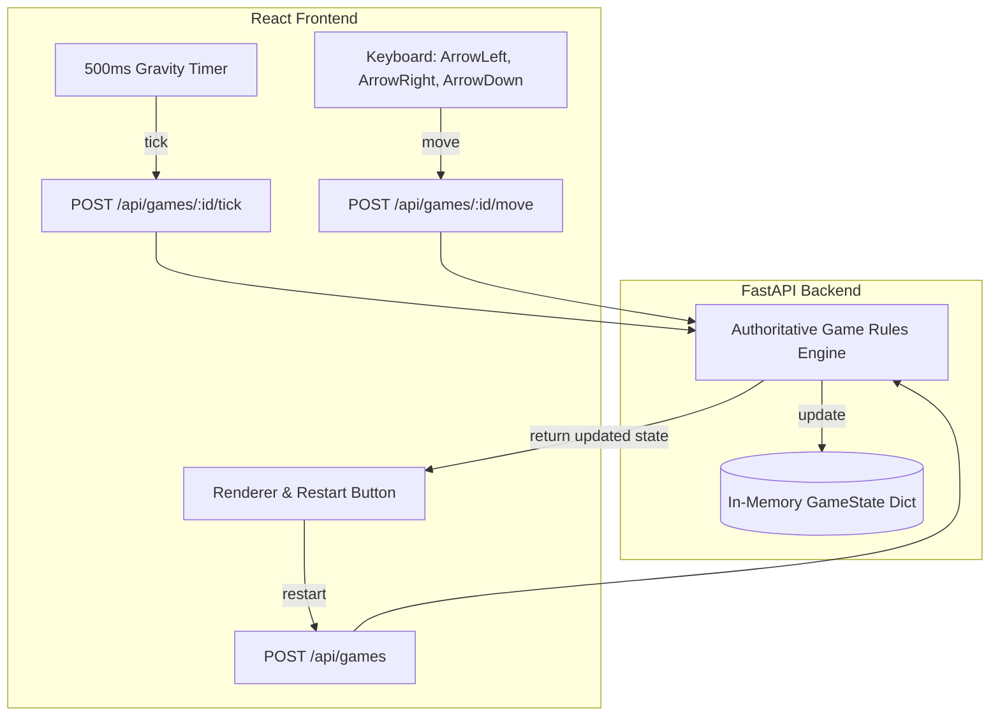

# Architecture Spine — Stage 1 Tetris Study

## Design Paradigm

The system implements a strictly decoupled client-server architecture acting as a pure authoritative state machine on the backend and a stateless renderer on the frontend.

- **Authoritative Backend (Python FastAPI):** Owns all game logic, board grid dimensions, tetromino spawns, coordinate shifts, collisions, locks, line clears, and game-over detection. Exposes standard stateless HTTP JSON APIs.
- **Thin Frontend (React + TypeScript):** Acts as a stateless renderer of the game board and active piece. Coordinates gravity ticks via a client-side 500ms timer and maps standard keyboard arrows directly to API movement endpoints.

## Invariants & Rules

### AD-1 — Authoritative Backend State Machine

- **Binds:** FR-1, FR-2, FR-4, FR-5, FR-15, FR-16, FR-17, FR-18, FR-19, FR-20, FR-21, FR-22, FR-23, FR-24, FR-25, FR-26
- **Prevents:** Client-side divergence, state desynchronization, and cheating.
- **Rule:** The Python FastAPI backend is the sole source of truth and validator for all game rules and board states. The frontend must never duplicate collision, locking, line clear, or game-over calculations.

### AD-2 — Stateless Frontend Renderer and Gravity Timer

- **Binds:** FR-14, FR-28, NFR-1
- **Prevents:** Gravity desynchronization and client-side movement stutter.
- **Rule:** The React frontend acts as a stateless renderer of the grid and active piece. It manages a client-side timer that dispatches `POST /api/games/{id}/tick` precisely every 500ms when status is `"playing"`. It must immediately clear the timer and lockout keyboard movement when the game status is `"game_over"`.

### AD-3 — Standard Board Properties and Coordinate System

- **Binds:** FR-4, FR-5
- **Prevents:** Out-of-bounds rendering or variable board size drift.
- **Rule:** The board is strictly 10 columns by 20 rows. Standard 0-indexed coordinate system where row 0 is top-most and row 19 is bottom-most; column 0 is left-most and column 9 is right-most.

### AD-4 — Excluded Features and Initial Orientation Only

- **Binds:** FR-10, Non-Goals
- **Prevents:** Scope creep and architectural bloating in Stage 1.
- **Rule:** No rotation, hold slot, next-piece preview, ghost piece, score calculation, or speed progression shall be implemented. The active piece retains its standard spawning orientation throughout its lifetime.

### AD-5 — Controls Layout

- **Binds:** FR-11, FR-12, FR-13, FR-30
- **Prevents:** Keyboard shortcut confusion or mismatch with the controlled experiment.
- **Rule:** Only `ArrowLeft`, `ArrowRight`, and `ArrowDown` keys are listened to for manual movement (left, right, and soft-drop respectively). No WASD or R keyboard shortcut. A visible button on the frontend is the only method to trigger a restart.

### AD-6 — Ephemeral In-Memory Sessions

- **Binds:** FR-2
- **Prevents:** Storage dependency, state persistence overhead, and complex local setup.
- **Rule:** All game sessions are stored ephemerally in-memory using a standard Python dictionary mapping UUID keys to game state instances on the FastAPI backend.



## Consistency Conventions

| Concern | Convention |
| --- | --- |
| Naming | Endpoints grouped under `/api/games`. Backend Python attributes in snake_case, matched with snake_case keys in API JSON payloads. |
| Data & formats | Game sessions identified by UUID strings. GameState contains: `id` (UUID), `status` (`playing` | `game_over`), `board` (2D grid), `active_piece` (shape, origin, cells). |
| State & cross-cutting | Ephemeral dict session storage. Exception handling returns standard FastAPI 422/404 HTTP errors. |

## Stack

| Name | Version |
| --- | --- |
| Python | >= 3.10 |
| FastAPI | ^0.100.0 |
| React | ^18.2.0 |
| TypeScript | ^5.0.0 |
| Vite | ^4.4.0 |
| pytest | ^7.4.0 |

## Structural Seed

```text
{root}/
  backend/
    app/
      main.py          # FastAPI application & entrypoint
      core/
        domain.py      # Core Tetris domain rules (Board, Piece, Tetromino, GameState)
      tests/
        test_domain.py # Standard domain tests (spawns, movement, collisions, clears)
  frontend/
    src/
      main.tsx         # Frontend entrypoint
      App.tsx          # Main component with layout, rendering, controls, timer, and restart
      styles.css       # Vanilla CSS for board centering, styling, and modern neon theme
```

## Deferred

- **Rotation System & SRS (AD-101):** Deferred to Phase 2. Wall kick tables and clockwise/counterclockwise rotations are not decided here.
- **Next Piece Queue & Hold (AD-102):** Deferred to Phase 3. Left open for next phase.
- **Persistent Storage (AD-103):** Deferred to Phase 4. Session cleanup or database schemas are not decided.
